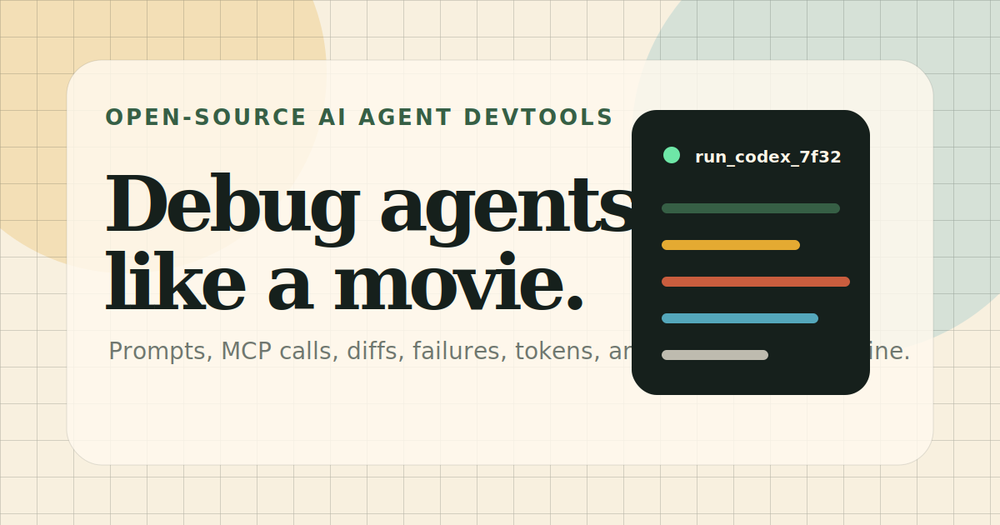

# AgentScope

Open-source DevTools for AI agents.

AgentScope turns AI agent runs into a readable timeline: prompts, reasoning, tool calls, MCP activity, file changes, failures, tokens, cost, and raw outputs in one local-first workspace.



## Why AgentScope

AI coding agents are becoming part of everyday development, but most runs are still hard to inspect after the fact. When something fails, teams need to know:

- What prompt or instruction started the run?
- What did the agent say, reason about, or skip?
- Which tools, commands, MCP servers, or files did it touch?
- Where did the failure happen?
- Can the run be shared, reviewed, or archived without sending data to a hosted service?

AgentScope is a lightweight trace viewer for answering those questions locally.

## Highlights

- **Local-first trace viewer**: no account, no backend, no telemetry required.
- **Folder scan import**: choose a Codex or Claude Code records folder, review detected traces, and load the one you need.
- **Codex support**: imports Codex rollout JSONL records.
- **Claude Code support**: imports transcript-style JSONL records.
- **Timeline review mode**: filter, search, jump, and move through events quickly.
- **Markdown / JSON / code viewer**: preview Markdown, format JSON, highlight code, and copy content.
- **Date-grouped event list**: events are grouped by day in a vertical timeline.
- **Trace export**: export the currently loaded trace as JSON.
- **Import diagnostics**: inspect skipped files, JSONL parse warnings, and detected trace candidates.
- **Privacy exports**: create sanitized JSON or single-file static HTML reports for review and sharing.

## Status

AgentScope is an early MVP. It is useful for viewing imported traces today, but the trace schema and importers may change before `1.0`.

## Demo Data

The repository includes a sample trace:

```text
data/sample-trace.json
data/fixtures/
```

The app does not load sample data by default. Start the app, then load a trace manually with **Load Trace** or **Scan Folder**.

## Quick Start

```bash
npm install
npm run dev
```

Open the local URL printed by Vite, usually:

```text
http://127.0.0.1:5173
```

Build for production:

```bash
npm run build
```

Preview the production build:

```bash
npm run preview
```

## Import Traces

### Load a single file

Use **Load Trace** to import:

- AgentScope trace JSON
- Codex rollout JSONL
- Claude Code transcript-style JSONL
- Generic AI tool JSON/JSONL with role/type/content fields

### Scan a folder

Use **Scan Folder** to select a local folder. AgentScope will scan candidate files, detect supported records, and open a picker when multiple traces are found. The import diagnostics panel lists detected traces, skipped files, and isolated JSONL parse warnings.

Recommended folders:

```text
~/.codex/sessions
~/.claude/projects
```

On Windows, Codex records are often under:

```text
C:\Users\<you>\.codex\sessions
```

Browser security requires manual folder selection. AgentScope cannot silently read hidden folders.

## Export Local Codex Records With Python

AgentScope also includes a helper script for exporting local Codex records:

```bash
python scripts/codex-rollout-to-trace.py --list
python scripts/codex-rollout-to-trace.py --latest --out data/codex-latest-trace.json
python scripts/codex-rollout-to-trace.py --thread 019f8551 --out data/my-run.trace.json
```

Codex rollout files are usually stored under:

```text
~/.codex/sessions/YYYY/MM/DD/rollout-*.jsonl
```

The script also reads the local Codex thread index:

```text
~/.codex/state_5.sqlite
```

## Trace Format

AgentScope uses a simple JSON shape:

```json
{
  "runId": "run_codex_7f32",
  "agent": "Codex CLI",
  "model": "gpt-5-codex",
  "status": "ok",
  "startedAt": "2026-07-21T14:08:12Z",
  "durationMs": 187000,
  "tokens": {
    "input": 42810,
    "output": 6312,
    "total": 49122
  },
  "costUsd": 1.84,
  "riskScore": 72,
  "summary": "Agent attempted to refactor a billing module and recovered after a failed test.",
  "steps": [
    {
      "id": "s1",
      "type": "tool",
      "title": "Tool Call: run_tests",
      "timestamp": "2026-07-21T14:12:02Z",
      "time": "14:12:02",
      "durationMs": 61000,
      "status": "failed",
      "tool": "shell.test",
      "input": "npm test -- billing",
      "output": "1 migration test failed"
    }
  ]
}
```

Supported step types:

- `prompt`
- `reasoning`
- `tool`
- `diff`

See [Trace Format](./docs/TRACE_FORMAT.md) for details.

## Privacy

Agent traces may contain sensitive information: prompts, source paths, code snippets, command output, secrets, customer data, or internal reasoning. Review traces before sharing them publicly.

Use **Sanitized JSON** to export a redacted trace. Use **HTML Report** to export a self-contained static report that uses the same redaction rules and can be opened without the AgentScope app. Automatic redaction covers common secret-like values and local file paths, but manual review is still required before public sharing.

See [Privacy Guide](./docs/PRIVACY.md) and [Security Policy](./SECURITY.md).

## Development

```bash
npm install
npm run dev
npm run build
```

Project structure:

```text
src/                         App source
data/                        Sample and generated traces
docs/                        Project documentation
scripts/                     Local import/export helpers
.github/                     GitHub issue and PR templates
```

See [Development Guide](./docs/DEVELOPMENT.md).

## Roadmap

- MCP proxy mode for capturing tool calls live.
- Importers for more AI tools and IDE extensions.
- Single-file HTML trace reports.
- Redaction rules for secrets and private paths.
- GitHub Action integration for CI traces.
- Trace comparison view.

See [Roadmap](./ROADMAP.md).

## Contributing

Contributions are welcome. Please read [CONTRIBUTING.md](./CONTRIBUTING.md) before opening a pull request.

## License

MIT. See [LICENSE](./LICENSE).
